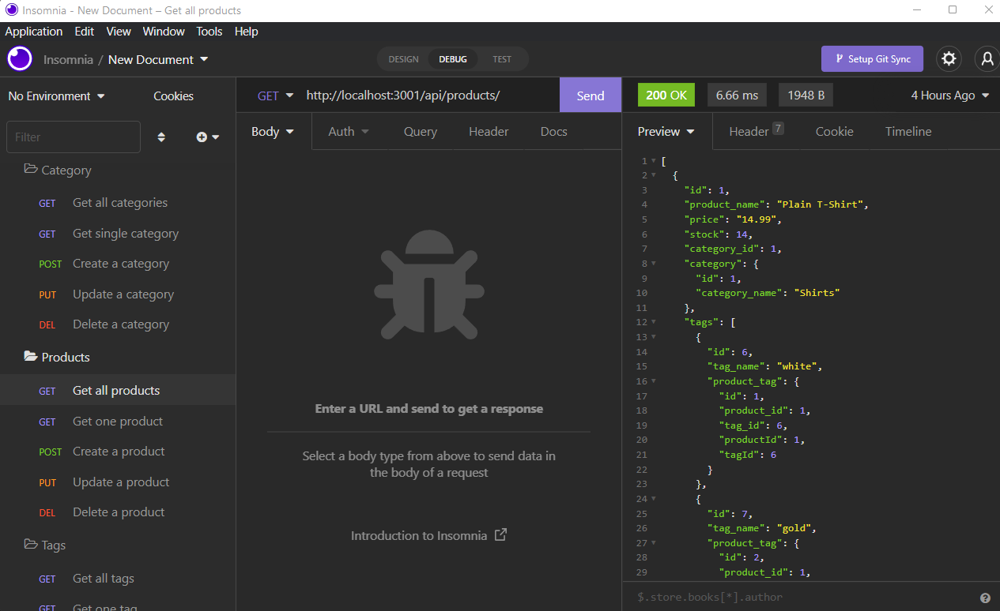

# E-commerce Back End

## Application Description
This is the back end for an e-commerce site. A working Express.js API is configured to use Sequelize to interact with a MySQL database. The user first creates the mysql database by logging into mysql and running "source db/schema.sql" and then seeding the data by running "npm run seed". To then run the application the user runs "npm start" and is able to use a program like Insomnia to get all categories/products/tags, get one item by id, post one creation, update one item, or delete one item from the database using the routes.  

## Challenge Description


## User Story

```
AS A manager at an internet retail company
I WANT a back end for my e-commerce website that uses the latest technologies
SO THAT my company can compete with other e-commerce companies
```

## Acceptance Criteria

```
GIVEN a functional Express.js API
WHEN I add my database name, MySQL username, and MySQL password to an environment variable file
THEN I am able to connect to a database using Sequelize
WHEN I enter schema and seed commands
THEN a development database is created and is seeded with test data
WHEN I enter the command to invoke the application
THEN my server is started and the Sequelize models are synced to the MySQL database
WHEN I open API GET routes in Insomnia Core for categories, products, or tags
THEN the data for each of these routes is displayed in a formatted JSON
WHEN I test API POST, PUT, and DELETE routes in Insomnia Core
THEN I am able to successfully create, update, and delete data in my database
```

## Tasks Completed
The JavaScript documents include:
* functions, variables, objects
* conditional statements, arrays, queries, and string interpolation
* node modules such as 
* comments


## Languages
- JavaScript


## Links
* [Application Walkthrough Video](https://drive.google.com/file/d/1IDJIRiFsONphgKkVpegD140XxCOyzprc/view)

* [Repository](https://github.com/villettec/M13C-E-commerce_Back_End)

## Screenshots



## Credit
Villette Comfort

villette@live.com